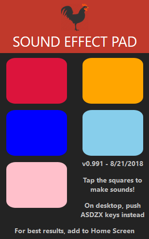

# sfxpad
Drum machine-like sound effect pad, intended for mobile browsers. On Mobile, touch the squares to make sounds. On a PC/Mac, use the keyboard keys (A,S,D,Z,X) instead. Try it out [here](https://coljonesdev.github.io/sfxpad/)! 

## Current functionality
* Plays five sounds upon tapping the squares - voice-imitated airhorn, actual airhorn, bass and snare drums, and a sitcom laugh
* iOS (as of 8-21) - Squares can be tapped rapidly, scroll-bounce won't occur on touchmove, works well in Safari but even more responsive as a Home Screen webapp
* Android (as of 8-21) - Noticeable (say, 1sec) delay between tapping square and hearing sound. Need to experiment more with an Android device

## Wishlist
* Desktop interface - use keyboard keys, show them on the buttons when running in desktop browser (media query?)
* Subtle scale tween animations (CSS @keyframe)
* Icon-coded buttons, rather than just random colors
* Generally more personal-feeling UI design, not just Web Developer course stuff
* Option to record your own sound and apply to a button (not sure if possible on iOS), and/or upload a file
* Make your own sound sets
* Possible sound sets: Humor, Rock Drums, Hip-hop Drums, 80s Drums
